<div align="center">

<!-- Header Banner -->


<!-- Badges -->
<br/>


<br/>

**🌐 [Ver Portafolio en Vivo](https://martinzapanaberrospi.github.io/portafolio/)**

<br/>

</div>

---

## 📋 Tabla de Contenidos

- [✨ Características](#-características)
- [🛠️ Tecnologías](#️-tecnologías)
- [📂 Estructura del Proyecto](#-estructura-del-proyecto)
- [🚀 Instalación y Uso](#-instalación-y-uso)
- [📸 Vista Previa](#-vista-previa)
- [🧩 Secciones](#-secciones)
- [📄 Licencia](#-licencia)

---

## ✨ Características

<table>
<tr>
<td width="50%">

### 🎨 Diseño & UI

- 🌌 **Fondo de partículas interactivo** con Canvas API
- 🪟 **Glassmorphism** en tarjetas y componentes
- ⌨️ **Efecto Typing** animado en el hero
- 📱 **Diseño 100% responsivo** (móvil, tablet, desktop)
- 🌙 **Tema oscuro premium** con acentos neón

</td>
<td width="50%">

### ⚙️ Funcionalidad

- 🔗 **Integración con GitHub API** — carga proyectos en tiempo real
- 🧭 **Navegación suave** con scroll spy activo
- 👁️ **Animaciones al scroll** (Intersection Observer)
- 📊 **Contadores animados** de estadísticas
- 📧 **Formulario de contacto** funcional

</td>
</tr>
</table>

---

## 🛠️ Tecnologías

<div align="center">

> Construido con tecnologías web modernas, sin frameworks pesados — puro rendimiento.

<br/>

<table>
<tr>
<td align="center" width="100">

<br/><sub><b>HTML5</b></sub>
</td>
<td align="center" width="100">

<br/><sub><b>CSS3</b></sub>
</td>
<td align="center" width="100">

<br/><sub><b>JavaScript</b></sub>
</td>
<td align="center" width="100">

<br/><sub><b>GitHub API</b></sub>
</td>
<td align="center" width="100">

<br/><sub><b>Canvas API</b></sub>
</td>
</tr>
</table>

<br/>

|    Categoría    | Detalle                                                                                                               |
| :-------------: | --------------------------------------------------------------------------------------------------------------------- |
|   **Fuentes**   | [Inter](https://fonts.google.com/specimen/Inter) · [JetBrains Mono](https://fonts.google.com/specimen/JetBrains+Mono) |
|   **Íconos**    | [Devicon](https://devicon.dev/) · SVG inline personalizados                                                           |
| **Animaciones** | CSS Keyframes · Intersection Observer API                                                                             |
| **Despliegue**  | GitHub Pages (CI/CD automático)                                                                                       |

</div>

---

## 📂 Estructura del Proyecto

```
portafolio/
│
├── 📄 index.html            # Página principal (SPA)
│
├── 🎨 css/
│   ├── style.css            # Estilos principales (~24 KB)
│   └── animations.css       # Keyframes y transiciones
│
├── ⚙️ js/
│   ├── main.js              # Lógica principal, partículas, scroll
│   └── github.js            # Integración con GitHub REST API
│
├── 🖼️ assets/
│   ├── profile.jpg          # Foto de perfil
│   └── favicon.svg          # Ícono de la pestaña
│
└── 📖 README.md             # Este archivo
```

---

## 🚀 Instalación y Uso

> No se requieren dependencias ni instalación. Solo archivos estáticos.

### Opción 1 — Clonar y abrir

```bash
# Clonar el repositorio
git clone https://github.com/MartinZapanaBerrospi/portafolio.git

# Entrar al directorio
cd portafolio

# Abrir en el navegador (o usar Live Server en VS Code)
start index.html
```

### Opción 2 — Live Server (recomendado para desarrollo)

1. Abre el proyecto en **VS Code**
2. Instala la extensión [Live Server](https://marketplace.visualstudio.com/items?itemName=ritwickdey.LiveServer)
3. Clic derecho en `index.html` → **Open with Live Server**

---

## 📸 Vista Previa

<div align="center">

|                                                           Desktop                                                            |                                                        Móvil                                                         |
| :--------------------------------------------------------------------------------------------------------------------------: | :------------------------------------------------------------------------------------------------------------------: |
|  |  |
|                                                Diseño completo con partículas                                                |                                           Navegación hamburguesa adaptada                                            |

<br/>

> 💡 **Tip:** Visita el [portafolio en vivo](https://martinzapanaberrospi.github.io/portafolio/) para ver todas las animaciones e interacciones.

</div>

---

## 🧩 Secciones

```mermaid
graph LR
    A["🏠 Inicio"] --> B["👤 Sobre Mí"]
    B --> C["💼 Experiencia"]
    C --> D["🛠️ Habilidades"]
    D --> E["📁 Proyectos"]
    E --> F["🎓 Educación"]
    F --> G["📧 Contacto"]

    style A fill:#6c63ff,stroke:#6c63ff,color:#fff
    style B fill:#5a52e0,stroke:#5a52e0,color:#fff
    style C fill:#4841c7,stroke:#4841c7,color:#fff
    style D fill:#3630ae,stroke:#3630ae,color:#fff
    style E fill:#241f95,stroke:#241f95,color:#fff
    style F fill:#120e7c,stroke:#120e7c,color:#fff
    style G fill:#00d4ff,stroke:#00d4ff,color:#000
```

<div align="center">



</div>

|  #   | Sección         | Descripción                                                                     |
| :--: | :-------------- | :------------------------------------------------------------------------------ |
| `01` | **Sobre Mí**    | Presentación personal con foto, badges de soft skills y descripción profesional |
| `02` | **Experiencia** | Timeline interactivo con historial laboral y de programación competitiva        |
| `03` | **Habilidades** | Grid de 22 tecnologías con íconos oficiales de Devicon                          |
| `04` | **Proyectos**   | Tarjetas cargadas dinámicamente desde la API de GitHub                          |
| `05` | **Educación**   | Timeline con formación académica y certificaciones                              |
| `06` | **Contacto**    | Formulario de contacto + enlaces a redes sociales                               |

---

## 🧠 Habilidades Técnicas

<div align="center">

### Lenguajes de Programación


### Desarrollo Web y Móvil


### Datos y Cloud


### Herramientas y Control de Versiones


### Inteligencia Artificial


</div>

---

## 📄 Licencia

Este proyecto está bajo la licencia **MIT**. Consulta el archivo [`LICENSE`](LICENSE) para más detalles.

---

<div align="center">

<!-- Footer Banner -->


<br/>

**Hecho con 💜 por [Martín Zapana](https://github.com/MartinZapanaBerrospi)**

<br/>

[](https://martinzapanaberrospi.github.io/portafolio/)
[](https://www.linkedin.com/in/martin-eduardo-zapana-berrospi-273728255/)
[](https://github.com/MartinZapanaBerrospi)

</div>
